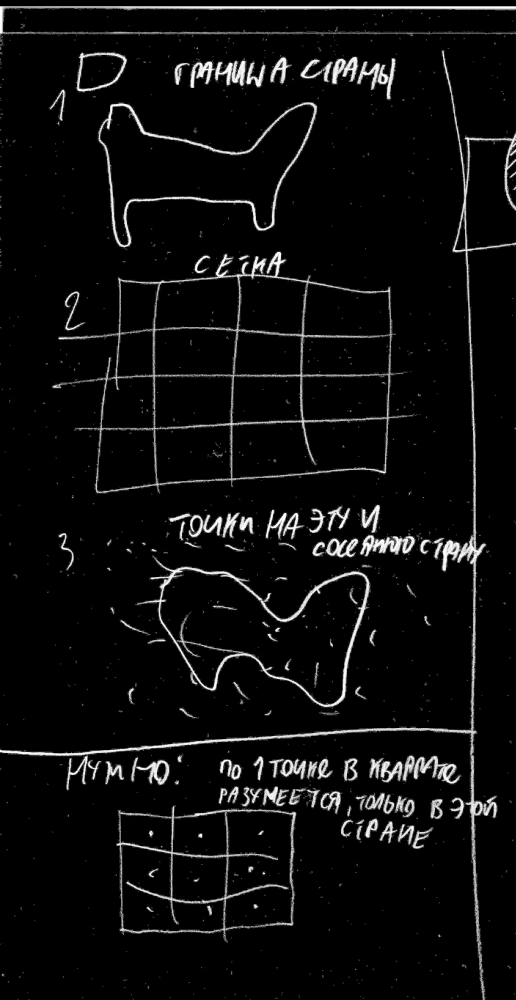
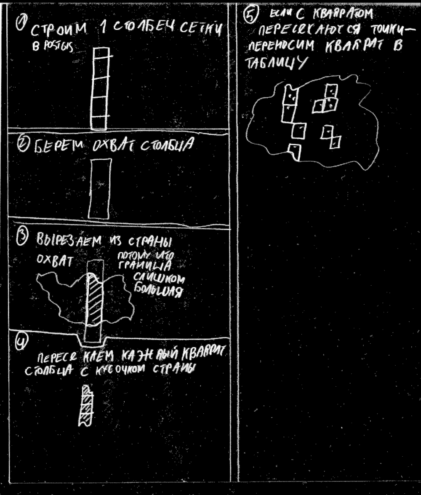

# Выгрузка POI по США с сеткой

# На входе: 
* source/List of Tags (OpenStreetMap) HillaryDonald App (1).xlsx - таблица нужных тегов с приоритетом. Если приоритет=0, то такие POI не нужны.
* Граница США в базе

Краткое описание алгоритма:
На территорию США генерируется сетка 1x1 миля. Для каждого квадрата берётся случайная точка POI из OSM с приоритетом 3. Если таких нет, то 2, если таких нет - то 1.
На выходе - слой с точками, слой с сеткой.

# Usage:

``
time python main.py
``

Для запуска разных частей алгоритма вручную - закомментировать вручную вызовы в файле main.py.  
Код лежит в process.py
Доступы к базе захардкодены в process.py
Часть структуры базы - в dump.sql Лучше один раз создать таблицы с индексами и последовательностями, и потом при повторных запусках скрипта им делать TRUNCATE, чем DROP; CREATE TABLE

# Более детальные описания фрагментов алгоритма

## Импорт списка тегов

Из csv список нужных тегов импортируется в PostGIS. Потом из этой таблицы генерируются строки для sql-запросов и osmfilter

## Импорт OSM

1. Выгружается osm.pbf - по Северной америке: США+Канада
2. .pbf > .o5m вместе с --drop-author
3. o5m фильтруется по списку тегов. 
4. o5m > pbf
5. pbf > osm2pgsql c кастомным стилем - special.style

Это наиболее быстрый способ импорта: если просто загнать pbf с кастомным стилем в osm2pgsql, то импорт занимает 48 часов. А с такой предварительной фильтрацией файла - 1 час 5 минут.

## Обработка

Отдельно в таблицу boundary импортируется полигон границы страны из OSM.

